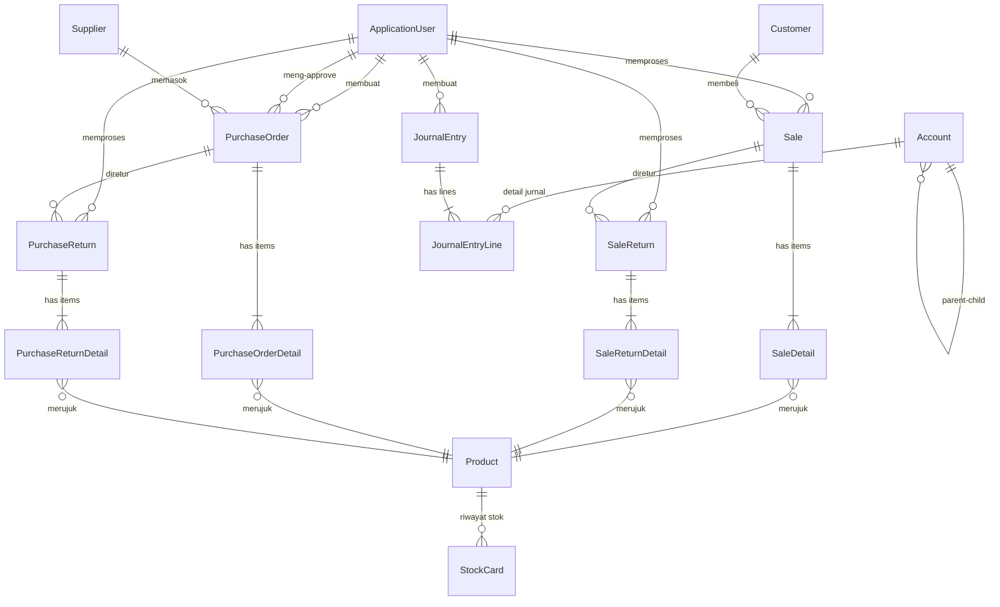

# Setup Repository & Struktur Solution .NET — SIA (Sistem Informasi Akuntansi) [REVISI]

> [!NOTE]
> **Dokumen ini adalah REVISI** dari `net_implementation_plan_Accounting_Project.md` asli.
> Semua 17 temuan dari review telah diintegrasikan. Perubahan dari plan asli ditandai dengan ✏️.

Setup repository dan scaffolding seluruh solution structure untuk proyek capstone Sistem Informasi Akuntansi **Toko Aki/Baterai Kendaraan** menggunakan Clean Architecture, Blazor Server (.NET 8), EF Core + MySQL, MudBlazor, dan ASP.NET Core Identity.

---

## Konteks Bisnis

| Aspek | Detail |
|-------|--------|
| **Jenis Usaha** | Toko aki/baterai kendaraan |
| **Skala** | UMKM — 2 staf, omset 300 juta – 2.5 miliar/tahun |
| **Transaksi Harian** | 10 – 50 transaksi |
| **Mata Uang** | Rupiah (IDR) saja, dengan separator ribuan |
| **Pajak (PPN)** | Tidak diperlukan (omzet < 4.8 miliar) |
| **Jurnal Umum** | Diinput **manual** oleh pengguna |
| **Stok** | Otomatis terupdate dari transaksi penjualan/pembelian/retur |
| **Piutang/Utang** | Didukung, pembayaran parsial/cicilan, muncul di Neraca |
| **Approval PO** | Ya — pemilik (Admin) approve sebelum order ke supplier |

---

## Entity Mapping: ERD PRD ↔ C# Class

> [!IMPORTANT]
> Tabel ini menunjukkan pemetaan antara setiap entitas di ERD PRD dengan class C# yang akan dibuat.
> Total entity: **19** (13 asal + 6 baru).
> ✏️ **Primary Key** semua entity menggunakan `int` auto-increment (bukan Guid).

| # | Entitas ERD PRD | C# Entity Class | Atribut Utama |
|---|----------------|-----------------|---------------|
| 1 | **Pengguna** | `ApplicationUser` (extends IdentityUser) | FullName, IsActive, CreatedAt ✏️ _(Email, UserName, PasswordHash sudah ada di IdentityUser)_ |
| 2 | **Akun** | `Account` | Id, Code, Name, Category (enum), NormalBalance (enum), Balance, Description, IsActive, ParentAccountId (FK, nullable) |
| 3 | **JurnalUmum** | `JournalEntry` | Id, ✏️ **JournalNumber**, TransactionDate, Description, UserId (FK) |
| 4 | **JurnalDetail** | `JournalEntryLine` | Id, JournalEntryId (FK), AccountId (FK), Debit, Credit |
| 5 | **Produk** | `Product` | Id, Name, Description, Category, ✏️ **Brand, BatteryType (enum), Voltage, Capacity**, SellingPrice, PurchasePrice, Stock, ReorderPoint, SKU |
| 6 | **Pelanggan** | `Customer` | Id, Name, Phone, Address |
| 7 | **Pemasok** | `Supplier` | Id, Name, Phone, Address |
| 8 | **PenjualanHeader** | `Sale` | Id, ✏️ **InvoiceNumber**, SaleDate, CustomerId (FK), UserId (FK), TotalAmount, ✏️ **PaidAmount, RemainingAmount**, PaymentMethod (enum), PaymentStatus (enum), Notes |
| 9 | **PenjualanDetail** | `SaleDetail` | Id, SaleId (FK), ProductId (FK), Quantity, UnitPrice, Subtotal |
| 10 | **PembelianHeader** | `PurchaseOrder` | Id, ✏️ **PONumber**, OrderDate, SupplierId (FK), UserId (FK), TotalAmount, ✏️ **PaidAmount, RemainingAmount**, Status (enum), ApprovedByUserId (FK), PaymentStatus (enum), Notes |
| 11 | **PembelianDetail** | `PurchaseOrderDetail` | Id, PurchaseOrderId (FK), ProductId (FK), Quantity, UnitPrice, Subtotal |
| 12 | **Pembayaran** | `Payment` | Id, ✏️ **PaymentNumber**, PaymentDate, ✏️ **PaymentMethod** (enum), ReferenceId, ReferenceType (enum), Amount, Notes |
| 13 | **KartuStok** | `StockCard` | Id, ProductId (FK), MovementDate, MovementType (enum), Quantity, StockBefore, StockAfter, Reference |
| 14 | ✏️ **ReturPenjualanHeader** | `SaleReturn` | Id, ReturnNumber, ReturnDate, SaleId (FK), UserId (FK), TotalAmount, Reason |
| 15 | ✏️ **ReturPenjualanDetail** | `SaleReturnDetail` | Id, SaleReturnId (FK), ProductId (FK), Quantity, UnitPrice, Subtotal |
| 16 | ✏️ **ReturPembelianHeader** | `PurchaseReturn` | Id, ReturnNumber, ReturnDate, PurchaseOrderId (FK), UserId (FK), TotalAmount, Reason |
| 17 | ✏️ **ReturPembelianDetail** | `PurchaseReturnDetail` | Id, PurchaseReturnId (FK), ProductId (FK), Quantity, UnitPrice, Subtotal |
| 18 | ✏️ **AuditLog** | `AuditLog` | Id (long), UserId, Action, EntityName, EntityId, OldValues (JSON), NewValues (JSON), Timestamp, IpAddress |
| 19 | ✏️ **KonfigurasiNomorTransaksi** | `TransactionNumberConfig` | Id, TransactionType, Prefix, Format, CurrentSequence, Year |

---

## ✏️ Role & Hak Akses

> [!IMPORTANT]
> **3 role** menggunakan ASP.NET Core Identity Roles + Policy-based Authorization.

| Role | Deskripsi | Hak Akses |
|------|-----------|-----------|
| **Admin** | Pemilik toko | Full access: semua modul, approve PO, kelola user, konfigurasi nomor transaksi, lihat audit log |
| **Staff** | Kasir / karyawan | Penjualan (CRUD), Pembelian (buat PO draft — tidak bisa approve), Inventory (lihat & update stok), Customer (CRUD), Supplier (CRUD), Payment (CRUD) |
| **Viewer** | Akuntan / read-only | Read-only semua data, input jurnal umum, lihat & cetak laporan keuangan. Tidak bisa create/edit/delete transaksi |

---

## Proposed Changes

### Solution & Project Structure

✏️ _Path dikoreksi ke lokasi repository yang benar._

```
C:\SIA-CP-Accounting-Project\
├── src\
│   ├── SIA.Domain\                 ← Class Library (.NET 8)
│   │   ├── Common\
│   │   │   └── BaseEntity.cs
│   │   ├── Entities\
│   │   │   ├── Accounting\         # Account, JournalEntry, JournalEntryLine
│   │   │   ├── Sales\              # Sale, SaleDetail, Customer,
│   │   │   │                       # ✏️ SaleReturn, SaleReturnDetail
│   │   │   ├── Purchasing\         # PurchaseOrder, PurchaseOrderDetail, Supplier,
│   │   │   │                       # ✏️ PurchaseReturn, PurchaseReturnDetail
│   │   │   ├── Inventory\          # Product, StockCard
│   │   │   ├── Payments\           # Payment
│   │   │   ├── Identity\           # ApplicationUser
│   │   │   └── ✏️ System\          # AuditLog, TransactionNumberConfig
│   │   └── Enums\                  # AccountCategory, NormalBalance, PaymentMethod,
│   │                               # PaymentStatus, PurchaseOrderStatus,
│   │                               # StockMovementType, ✏️ BatteryType,
│   │                               # ✏️ ReferenceType (menggantikan PaymentType)
│   │
│   ├── SIA.Application\            ← Class Library (.NET 8)
│   │   ├── Common\
│   │   │   └── Interfaces\
│   │   │       ├── IRepository.cs
│   │   │       ├── IUnitOfWork.cs
│   │   │       └── ✏️ IAuditService.cs
│   │   ├── Services\
│   │   │   ├── Accounting\         # IAccountService, IJournalService
│   │   │   ├── Sales\              # ISaleService, ICustomerService,
│   │   │   │                       # ✏️ ISaleReturnService
│   │   │   ├── Purchasing\         # IPurchaseOrderService, ISupplierService,
│   │   │   │                       # ✏️ IPurchaseReturnService
│   │   │   ├── Inventory\          # IProductService, IStockCardService
│   │   │   ├── Payments\           # IPaymentService
│   │   │   ├── Reporting\          # IFinancialReportService
│   │   │   └── ✏️ System\          # ITransactionNumberService
│   │   └── DTOs\                   # Data Transfer Objects per module
│   │
│   ├── SIA.Infrastructure\         ← Class Library (.NET 8)
│   │   ├── Data\
│   │   │   ├── AppDbContext.cs
│   │   │   ├── Configurations\     # EF Core Fluent API per entity
│   │   │   └── ✏️ Interceptors\    # AuditSaveChangesInterceptor.cs
│   │   ├── Repositories\
│   │   │   └── Repository.cs
│   │   ├── Services\               # Concrete service implementations
│   │   └── DependencyInjection.cs
│   │
│   └── SIA.Web\                    ← Blazor Web App (.NET 8, Server render mode)
│       ├── Components\
│       │   ├── Layout\             # MainLayout, NavMenu
│       │   └── Pages\
│       │       ├── Auth\           # Login, Logout
│       │       ├── Accounting\     # ChartOfAccounts, JournalEntries
│       │       ├── Sales\          # SalesList, SalesForm, CustomerList,
│       │       │                   # ✏️ SaleReturnList, SaleReturnForm,
│       │       │                   # ✏️ InvoicePrint
│       │       ├── Purchasing\     # PurchaseOrderList, PurchaseOrderForm,
│       │       │                   # SupplierList,
│       │       │                   # ✏️ PurchaseReturnList, PurchaseReturnForm
│       │       ├── Inventory\      # ProductList, StockCard
│       │       ├── Reporting\      # BalanceSheet, IncomeStatement, CashFlow
│       │       └── ✏️ Admin\       # UserManagement, TransactionNumberConfig,
│       │                           # AuditLogViewer
│       ├── wwwroot\
│       │   └── ✏️ css\
│       │       └── print.css       # CSS @media print untuk nota
│       └── Program.cs
│
├── tests\
│   └── SIA.Tests\                  ← xUnit Test Project (.NET 8)
│       ├── Domain\
│       ├── Application\
│       └── Infrastructure\
│
├── .github\
│   └── workflows\
│       └── ci.yml
│
├── SIA.sln
├── .gitignore
├── .editorconfig
└── README.md
```

---

### SIA.Domain — Entity & Enum Definitions

#### [NEW] `SIA.Domain.csproj`
Class library targeting `net8.0`. No external dependencies — pure C# domain model.

---

#### ✏️ [NEW] `Common/BaseEntity.cs`
Abstract base class dengan soft delete support.

```csharp
public abstract class BaseEntity
{
    public int Id { get; set; }                  // ✏️ int, bukan Guid
    public DateTime CreatedAt { get; set; }
    public DateTime? UpdatedAt { get; set; }
    public bool IsDeleted { get; set; }          // ✏️ Soft delete flag
    public DateTime? DeletedAt { get; set; }     // ✏️ Waktu penghapusan
}
```

---

#### [NEW] `Entities/Identity/ApplicationUser.cs`
Extends `IdentityUser`. ✏️ Hanya menambah property yang **belum ada** di `IdentityUser`.

```csharp
public class ApplicationUser : IdentityUser
{
    // ✏️ Email, UserName, PasswordHash TIDAK dideklarasikan ulang
    //    — sudah ada di IdentityUser base class
    public string FullName { get; set; }
    public bool IsActive { get; set; } = true;
    public DateTime CreatedAt { get; set; } = DateTime.UtcNow;

    // Navigation properties
    public ICollection<JournalEntry> JournalEntries { get; set; }
    public ICollection<Sale> Sales { get; set; }
    public ICollection<PurchaseOrder> CreatedPurchaseOrders { get; set; }
    public ICollection<PurchaseOrder> ApprovedPurchaseOrders { get; set; }
}
```

---

#### [NEW] `Entities/Accounting/Account.cs`
✏️ Ditambahkan `ParentAccountId` untuk hierarki Chart of Accounts.

```csharp
public class Account : BaseEntity
{
    public string Code { get; set; }               // e.g. "1-1001"
    public string Name { get; set; }               // e.g. "Kas"
    public AccountCategory Category { get; set; }
    public NormalBalance NormalBalance { get; set; }
    public decimal Balance { get; set; }           // ✏️ Stored, diupdate saat jurnal posting
    public string? Description { get; set; }
    public bool IsActive { get; set; } = true;

    // ✏️ Self-referencing untuk hierarki akun
    public int? ParentAccountId { get; set; }
    public Account? ParentAccount { get; set; }
    public ICollection<Account> ChildAccounts { get; set; }

    // Navigation
    public ICollection<JournalEntryLine> JournalEntryLines { get; set; }
}
```

> [!NOTE]
> **Balance Consistency Strategy (✏️)**: `Account.Balance` disimpan di database dan diupdate setiap kali jurnal diposting. Disediakan fitur **"Rekalkulasi Saldo"** di halaman admin untuk menghitung ulang seluruh saldo dari `SUM(JournalEntryLine)` sebagai safety net.

---

#### [NEW] `Entities/Accounting/JournalEntry.cs`
✏️ Ditambahkan `JournalNumber` untuk penomoran otomatis.

```csharp
public class JournalEntry : BaseEntity
{
    public string JournalNumber { get; set; }      // ✏️ e.g. "JRN-2026-0001"
    public DateTime TransactionDate { get; set; }
    public string Description { get; set; }
    public string UserId { get; set; }             // FK ke ApplicationUser
    public ApplicationUser User { get; set; }

    public ICollection<JournalEntryLine> Lines { get; set; }
}
```

#### [NEW] `Entities/Accounting/JournalEntryLine.cs`
```csharp
public class JournalEntryLine : BaseEntity
{
    public int JournalEntryId { get; set; }
    public JournalEntry JournalEntry { get; set; }
    public int AccountId { get; set; }
    public Account Account { get; set; }
    public decimal Debit { get; set; }
    public decimal Credit { get; set; }
}
```

---

#### [NEW] `Entities/Sales/Customer.cs`
```csharp
public class Customer : BaseEntity
{
    public string Name { get; set; }
    public string? Phone { get; set; }
    public string? Address { get; set; }
    public ICollection<Sale> Sales { get; set; }
}
```

#### ✏️ [NEW] `Entities/Sales/Sale.cs`
Ditambahkan `InvoiceNumber`, `PaidAmount`, `RemainingAmount`.

```csharp
public class Sale : BaseEntity
{
    public string InvoiceNumber { get; set; }      // ✏️ e.g. "INV-2026-0001"
    public DateTime SaleDate { get; set; }
    public int CustomerId { get; set; }
    public Customer Customer { get; set; }
    public string UserId { get; set; }
    public ApplicationUser User { get; set; }
    public decimal TotalAmount { get; set; }
    public decimal PaidAmount { get; set; }        // ✏️ Total yang sudah dibayar
    public decimal RemainingAmount { get; set; }   // ✏️ Sisa yang belum dibayar
    public PaymentMethod PaymentMethod { get; set; }
    public PaymentStatus PaymentStatus { get; set; }
    public string? Notes { get; set; }

    public ICollection<SaleDetail> Details { get; set; }
    public ICollection<SaleReturn> Returns { get; set; }  // ✏️
}
```

#### [NEW] `Entities/Sales/SaleDetail.cs`
```csharp
public class SaleDetail : BaseEntity
{
    public int SaleId { get; set; }
    public Sale Sale { get; set; }
    public int ProductId { get; set; }
    public Product Product { get; set; }
    public int Quantity { get; set; }
    public decimal UnitPrice { get; set; }
    public decimal Subtotal { get; set; }
}
```

#### ✏️ [NEW] `Entities/Sales/SaleReturn.cs`
```csharp
public class SaleReturn : BaseEntity
{
    public string ReturnNumber { get; set; }       // e.g. "SRT-2026-0001"
    public DateTime ReturnDate { get; set; }
    public int SaleId { get; set; }
    public Sale Sale { get; set; }
    public string UserId { get; set; }
    public ApplicationUser User { get; set; }
    public decimal TotalAmount { get; set; }
    public string? Reason { get; set; }

    public ICollection<SaleReturnDetail> Details { get; set; }
}
```

#### ✏️ [NEW] `Entities/Sales/SaleReturnDetail.cs`
```csharp
public class SaleReturnDetail : BaseEntity
{
    public int SaleReturnId { get; set; }
    public SaleReturn SaleReturn { get; set; }
    public int ProductId { get; set; }
    public Product Product { get; set; }
    public int Quantity { get; set; }
    public decimal UnitPrice { get; set; }
    public decimal Subtotal { get; set; }
}
```

---

#### [NEW] `Entities/Purchasing/Supplier.cs`
```csharp
public class Supplier : BaseEntity
{
    public string Name { get; set; }
    public string? Phone { get; set; }
    public string? Address { get; set; }
    public ICollection<PurchaseOrder> PurchaseOrders { get; set; }
}
```

#### ✏️ [NEW] `Entities/Purchasing/PurchaseOrder.cs`
Ditambahkan `PONumber`, `PaidAmount`, `RemainingAmount`.

```csharp
public class PurchaseOrder : BaseEntity
{
    public string PONumber { get; set; }           // ✏️ e.g. "PO-2026-0001"
    public DateTime OrderDate { get; set; }
    public int SupplierId { get; set; }
    public Supplier Supplier { get; set; }
    public string UserId { get; set; }             // FK — pembuat PO
    public ApplicationUser User { get; set; }
    public decimal TotalAmount { get; set; }
    public decimal PaidAmount { get; set; }        // ✏️
    public decimal RemainingAmount { get; set; }   // ✏️
    public PurchaseOrderStatus Status { get; set; }
    public string? ApprovedByUserId { get; set; }  // FK — yang approve (nullable)
    public ApplicationUser? ApprovedByUser { get; set; }
    public PaymentStatus PaymentStatus { get; set; }
    public string? Notes { get; set; }

    public ICollection<PurchaseOrderDetail> Details { get; set; }
    public ICollection<PurchaseReturn> Returns { get; set; }  // ✏️
}
```

#### [NEW] `Entities/Purchasing/PurchaseOrderDetail.cs`
```csharp
public class PurchaseOrderDetail : BaseEntity
{
    public int PurchaseOrderId { get; set; }
    public PurchaseOrder PurchaseOrder { get; set; }
    public int ProductId { get; set; }
    public Product Product { get; set; }
    public int Quantity { get; set; }
    public decimal UnitPrice { get; set; }
    public decimal Subtotal { get; set; }
}
```

#### ✏️ [NEW] `Entities/Purchasing/PurchaseReturn.cs`
```csharp
public class PurchaseReturn : BaseEntity
{
    public string ReturnNumber { get; set; }       // e.g. "PRT-2026-0001"
    public DateTime ReturnDate { get; set; }
    public int PurchaseOrderId { get; set; }
    public PurchaseOrder PurchaseOrder { get; set; }
    public string UserId { get; set; }
    public ApplicationUser User { get; set; }
    public decimal TotalAmount { get; set; }
    public string? Reason { get; set; }

    public ICollection<PurchaseReturnDetail> Details { get; set; }
}
```

#### ✏️ [NEW] `Entities/Purchasing/PurchaseReturnDetail.cs`
```csharp
public class PurchaseReturnDetail : BaseEntity
{
    public int PurchaseReturnId { get; set; }
    public PurchaseReturn PurchaseReturn { get; set; }
    public int ProductId { get; set; }
    public Product Product { get; set; }
    public int Quantity { get; set; }
    public decimal UnitPrice { get; set; }
    public decimal Subtotal { get; set; }
}
```

---

#### ✏️ [NEW] `Entities/Inventory/Product.cs`
Atribut **Size/Color dihapus**, diganti atribut khusus aki.

```csharp
public class Product : BaseEntity
{
    public string Name { get; set; }
    public string? Description { get; set; }
    public string? Category { get; set; }          // e.g. "Aki Motor", "Aki Mobil"

    // ✏️ Atribut khusus aki — menggantikan Size/Color
    public string? Brand { get; set; }             // e.g. "GS Astra", "Yuasa", "Bosch"
    public BatteryType? BatteryType { get; set; }  // Basah, Kering, AGM, GEL
    public string? Voltage { get; set; }           // e.g. "12V"
    public string? Capacity { get; set; }          // e.g. "45Ah"

    public decimal SellingPrice { get; set; }
    public decimal PurchasePrice { get; set; }
    public int Stock { get; set; }
    public int ReorderPoint { get; set; }          // Batas minimum stok sebelum alert
    public string? SKU { get; set; }               // e.g. "GS-12V-45AH-KERING"

    public ICollection<StockCard> StockCards { get; set; }
    public ICollection<SaleDetail> SaleDetails { get; set; }
    public ICollection<PurchaseOrderDetail> PurchaseOrderDetails { get; set; }
}
```

#### [NEW] `Entities/Inventory/StockCard.cs`
✏️ `StockMovementType` diperluas untuk mendukung retur.

```csharp
public class StockCard : BaseEntity
{
    public int ProductId { get; set; }
    public Product Product { get; set; }
    public DateTime MovementDate { get; set; }
    public StockMovementType MovementType { get; set; } // ✏️ In, Out, ReturnIn, ReturnOut
    public int Quantity { get; set; }
    public int StockBefore { get; set; }
    public int StockAfter { get; set; }
    public string? Reference { get; set; }         // e.g. "INV-2026-0001" atau "SRT-2026-0001"
}
```

---

#### ✏️ [NEW] `Entities/Payments/Payment.cs`
`PaymentType` diganti `PaymentMethod` (enum yang digabungkan). Ditambahkan `PaymentNumber`.

```csharp
public class Payment : BaseEntity
{
    public string PaymentNumber { get; set; }      // ✏️ e.g. "PAY-2026-0001"
    public DateTime PaymentDate { get; set; }
    public PaymentMethod PaymentMethod { get; set; } // ✏️ Menggantikan PaymentType
    public int ReferenceId { get; set; }            // Polimorfik — ID Sale/PO
    public ReferenceType ReferenceType { get; set; } // ✏️ Enum: Sale, PurchaseOrder
    public decimal Amount { get; set; }
    public string? Notes { get; set; }
}
```

> [!WARNING]
> **Polimorfik Reference**: `Payment.ReferenceId` + `ReferenceType` tidak memiliki FK constraint di database. Validasi integritas data dilakukan di **Application layer** (`IPaymentService`). Index `(ReferenceType, ReferenceId)` ditambahkan di EF Core Configuration untuk performance.

---

#### ✏️ [NEW] `Entities/System/AuditLog.cs`
```csharp
public class AuditLog
{
    public long Id { get; set; }                   // long — bisa sangat banyak record
    public string? UserId { get; set; }
    public string Action { get; set; }             // "Create", "Update", "Delete"
    public string EntityName { get; set; }         // "Product", "Sale", etc.
    public string EntityId { get; set; }           // ID entity yang diubah
    public string? OldValues { get; set; }         // JSON snapshot sebelum
    public string? NewValues { get; set; }         // JSON snapshot sesudah
    public DateTime Timestamp { get; set; }
    public string? IpAddress { get; set; }
}
```

> [!NOTE]
> Implementasi via **EF Core `SaveChangesInterceptor`** — otomatis menangkap perubahan entity saat `SaveChangesAsync()` dipanggil. File: `Infrastructure/Data/Interceptors/AuditSaveChangesInterceptor.cs`.

---

#### ✏️ [NEW] `Entities/System/TransactionNumberConfig.cs`
```csharp
public class TransactionNumberConfig
{
    public int Id { get; set; }
    public string TransactionType { get; set; }    // "Sale", "PurchaseOrder", "JournalEntry", etc.
    public string Prefix { get; set; }             // "INV", "PO", "JRN", etc.
    public string Format { get; set; }             // "{Prefix}-{Year}-{Seq:0000}"
    public int CurrentSequence { get; set; }       // Auto-increment per tahun
    public int Year { get; set; }                  // Reset sequence setiap tahun baru
}
```

---

#### ✏️ [NEW] `Enums/*.cs`

```csharp
// AccountCategory.cs — ✏️ Ditambahkan LiabilitasJangkaPanjang, PendapatanLainLain, BebanLainLain
public enum AccountCategory
{
    AsetLancar,
    AsetTetap,
    LiabilitasJangkaPendek,
    LiabilitasJangkaPanjang,       // ✏️ Baru
    Ekuitas,
    Pendapatan,
    PendapatanLainLain,            // ✏️ Baru
    BebanPokokPenjualan,
    BebanOperasional,
    BebanLainLain                  // ✏️ Baru
}

// NormalBalance.cs — Tidak berubah
public enum NormalBalance { Debit, Credit }

// PaymentMethod.cs — ✏️ Menggantikan PaymentMethod DAN PaymentType (digabung)
public enum PaymentMethod { Cash, Transfer }

// PaymentStatus.cs — ✏️ Ditambahkan PartiallyPaid
public enum PaymentStatus
{
    Unpaid,
    PartiallyPaid,                 // ✏️ Baru — sebagian sudah dibayar
    Paid
}

// PurchaseOrderStatus.cs — Tidak berubah
public enum PurchaseOrderStatus { Draft, Approved, Received, Cancelled }

// StockMovementType.cs — ✏️ Ditambahkan ReturnIn, ReturnOut
public enum StockMovementType
{
    In,                            // Masuk dari pembelian
    Out,                           // Keluar dari penjualan
    ReturnIn,                      // ✏️ Masuk dari retur penjualan (barang kembali ke gudang)
    ReturnOut                      // ✏️ Keluar dari retur pembelian (barang dikembalikan ke supplier)
}

// ✏️ BatteryType.cs — Baru, menggantikan konsep Size/Color
public enum BatteryType
{
    Basah,                         // Aki basah / konvensional
    Kering,                        // MF (Maintenance Free)
    AGM,                           // Absorbed Glass Mat
    GEL                            // Gel cell
}

// ✏️ ReferenceType.cs — Baru, dipakai oleh Payment (polimorfik)
public enum ReferenceType
{
    Sale,
    PurchaseOrder
}
```

> [!IMPORTANT]
> ✏️ **Enum `PaymentType` dihapus** — digabung dengan `PaymentMethod` karena nilainya identik.

---

### SIA.Application — Interfaces, Services & DTOs

#### [NEW] `SIA.Application.csproj`
References `SIA.Domain`. No infrastructure dependencies.

#### [NEW] `Common/Interfaces/IRepository.cs`
Generic repository: `GetByIdAsync`, `GetAllAsync`, `AddAsync`, `Update`, `Delete`, `FindAsync(predicate)`.

#### [NEW] `Common/Interfaces/IUnitOfWork.cs`
`SaveChangesAsync()` + exposes typed repositories.

#### ✏️ [NEW] `Common/Interfaces/IAuditService.cs`
Interface untuk audit logging.

#### ✏️ [NEW] Service interfaces per modul

| Service Interface | Deskripsi |
|-------------------|-----------|
| `IAccountService` | CRUD akun (Chart of Accounts), ✏️ **rekalkulasi saldo dari jurnal** |
| `IJournalService` | Posting double-entry, validasi debit = kredit, ✏️ **update Account.Balance saat posting** |
| `ISaleService` | ✏️ Buat transaksi penjualan, **otomatis kurangi stok + buat StockCard entry** _(jurnal TIDAK otomatis)_ |
| `ICustomerService` | CRUD pelanggan |
| `IPurchaseOrderService` | Buat PO, approval, terima barang (otomatis tambah stok saat status = Received) |
| `ISupplierService` | CRUD pemasok |
| `IProductService` | ✏️ CRUD produk (termasuk atribut aki: Brand, BatteryType, Voltage, Capacity) |
| `IStockCardService` | Kartu stok, reorder alert |
| `IPaymentService` | ✏️ Pencatatan pembayaran piutang/utang, **update PaidAmount/RemainingAmount/PaymentStatus** di Sale/PO |
| `IFinancialReportService` | Generate neraca, laba rugi, arus kas |
| ✏️ `ISaleReturnService` | **Baru** — retur penjualan, otomatis tambah stok kembali |
| ✏️ `IPurchaseReturnService` | **Baru** — retur pembelian, otomatis kurangi stok |
| ✏️ `ITransactionNumberService` | **Baru** — generate nomor transaksi otomatis, konfigurasi format |

---

### SIA.Infrastructure — EF Core, Repositories, Concrete Services

#### [NEW] `SIA.Infrastructure.csproj`
References `SIA.Application` & `SIA.Domain`. NuGet packages:
- `Pomelo.EntityFrameworkCore.MySql`
- `Microsoft.AspNetCore.Identity.EntityFrameworkCore`
- `Microsoft.EntityFrameworkCore.Design`

#### ✏️ [NEW] `Data/AppDbContext.cs`
Inherits `IdentityDbContext<ApplicationUser>`. ✏️ **19 entities** registered as `DbSet<>`. Override `SaveChangesAsync` untuk:
1. Auto-set `CreatedAt`, `UpdatedAt` timestamps
2. Soft delete — intercept `Delete` dan ubah ke `IsDeleted = true`
3. ✏️ **Global Query Filter** — `entity.HasQueryFilter(e => !e.IsDeleted)` untuk semua entity yang extend `BaseEntity`

```csharp
// Contoh Global Query Filter di OnModelCreating
protected override void OnModelCreating(ModelBuilder builder)
{
    base.OnModelCreating(builder);

    // Soft delete global filter untuk semua BaseEntity
    foreach (var entityType in builder.Model.GetEntityTypes())
    {
        if (typeof(BaseEntity).IsAssignableFrom(entityType.ClrType))
        {
            var parameter = Expression.Parameter(entityType.ClrType, "e");
            var property = Expression.Property(parameter, nameof(BaseEntity.IsDeleted));
            var filter = Expression.Lambda(Expression.Not(property), parameter);
            builder.Entity(entityType.ClrType).HasQueryFilter(filter);
        }
    }

    // ✏️ Index untuk Payment polimorfik reference
    builder.Entity<Payment>()
        .HasIndex(p => new { p.ReferenceType, p.ReferenceId });

    builder.ApplyConfigurationsFromAssembly(typeof(AppDbContext).Assembly);
}
```

#### [NEW] `Data/Configurations/*.cs`
`IEntityTypeConfiguration<T>` per entity. ✏️ Termasuk configuration untuk 6 entity baru.

#### ✏️ [NEW] `Data/Interceptors/AuditSaveChangesInterceptor.cs`
EF Core `SaveChangesInterceptor` yang otomatis menulis ke `AuditLog` saat entity berubah.

#### [NEW] `Repositories/Repository.cs`
Generic `Repository<T> : IRepository<T>` implementation.

#### [NEW] `DependencyInjection.cs`
Extension method `AddInfrastructure(this IServiceCollection, IConfiguration)`.

---

### SIA.Web — Blazor Server Frontend

#### [NEW] `SIA.Web.csproj`
Blazor Web App. References `SIA.Application` & `SIA.Infrastructure`. NuGet: `MudBlazor`.

#### [NEW] `Program.cs`
Complete startup: DI, Identity config (✏️ termasuk 3 role seeding), MudBlazor, auth middleware, HTTPS.

```csharp
// ✏️ Role seeding di Program.cs
using (var scope = app.Services.CreateScope())
{
    var roleManager = scope.ServiceProvider.GetRequiredService<RoleManager<IdentityRole>>();
    string[] roles = { "Admin", "Staff", "Viewer" };
    foreach (var role in roles)
    {
        if (!await roleManager.RoleExistsAsync(role))
            await roleManager.CreateAsync(new IdentityRole(role));
    }
}
```

#### [NEW] `Components/Layout/MainLayout.razor` & `NavMenu.razor`
MudBlazor layout + navigation sesuai modul PRD. ✏️ Menu items di-filter berdasarkan role user.

#### ✏️ Halaman per modul (dengan tambahan baru)

| Modul | Halaman | Role Akses |
|-------|---------|------------|
| **Auth** | Login, Logout | Semua |
| **Accounting** | ChartOfAccounts, JournalEntries | Admin, Viewer |
| **Sales** | SalesList, SalesForm, CustomerList, ✏️ **SaleReturnList, SaleReturnForm, InvoicePrint** | Admin, Staff |
| **Purchasing** | PurchaseOrderList, PurchaseOrderForm, SupplierList, ✏️ **PurchaseReturnList, PurchaseReturnForm** | Admin, Staff (Staff: tidak bisa approve) |
| **Inventory** | ProductList, StockCard | Admin, Staff |
| **Reporting** | BalanceSheet, IncomeStatement, CashFlow | Admin, Viewer |
| ✏️ **Admin** | **UserManagement, TransactionNumberConfig, AuditLogViewer** | Admin only |

#### ✏️ [NEW] `Components/Pages/Sales/InvoicePrint.razor`
Halaman cetak nota penjualan — menggunakan CSS `@media print` untuk layout nota yang bersih.

#### ✏️ [NEW] `wwwroot/css/print.css`
Stylesheet khusus untuk print — hide navbar, sidebar, footer saat cetak.

```css
@media print {
    .mud-appbar, .mud-drawer, .mud-footer, .no-print {
        display: none !important;
    }
    body { 
        font-size: 12pt;
        color: #000;
    }
    .print-container {
        width: 100%;
        max-width: 80mm; /* Ukuran struk thermal */
    }
}
```

---

### SIA.Tests — xUnit Test Project

#### [NEW] `SIA.Tests.csproj`
xUnit + Moq. References Domain, Application, Infrastructure.

#### ✏️ Test cases yang harus di-cover:

| Area | Test Cases |
|------|------------|
| **Domain** | BaseEntity soft delete properties, enum value validation |
| **Journal** | Debit = Credit validation, Account.Balance update after posting |
| **Sale** | Stok berkurang setelah penjualan, InvoiceNumber auto-generated |
| **PurchaseOrder** | Status workflow (Draft→Approved→Received), stok bertambah saat Received |
| **Payment** | PaidAmount/RemainingAmount kalkulasi benar, PaymentStatus auto-update |
| **SaleReturn** | Stok bertambah setelah retur, StockCard entry type = ReturnIn |
| **PurchaseReturn** | Stok berkurang setelah retur, StockCard entry type = ReturnOut |
| **TransactionNumber** | Auto-increment, reset per tahun, format konfigurasi |

---

### Repository Files

#### [NEW] `.gitignore` — .NET/Visual Studio template
#### [NEW] `.editorconfig` — C# coding conventions
#### [NEW] `README.md` — Deskripsi proyek (Bahasa Indonesia)
#### [NEW] `.github/workflows/ci.yml` — Build & test on push/PR

---

## Relasi antar Entity (sesuai ERD Revisi)



> [!NOTE]
> **Payment tidak digambarkan di ERD** karena menggunakan polimorfik reference (`ReferenceId` + `ReferenceType`), bukan FK langsung. Payment merujuk ke `Sale` atau `PurchaseOrder` via logic di Application layer.

---

## Rangkuman Perubahan dari Plan Asli

| # | Perubahan | Kategori |
|---|-----------|----------|
| 1 | Product: `Size`/`Color` → `Brand`/`BatteryType`/`Voltage`/`Capacity` | 🔴 Fix Kritis |
| 2 | ISaleService: hapus "otomatis posting jurnal" (jurnal manual) | 🔴 Fix Kritis |
| 3 | Gabung enum `PaymentType` ke `PaymentMethod` (hapus duplikat) | 🔴 Fix Kritis |
| 4 | `PaymentStatus`: tambah `PartiallyPaid` | 🔴 Fix Kritis |
| 5 | Payment: `PaymentType` → `PaymentMethod` + tambah validasi polimorfik | 🔴 Fix Kritis |
| 6 | Tambah nomor transaksi otomatis + entity `TransactionNumberConfig` | 🟡 Fitur Baru |
| 7 | Tambah 4 entity retur: `SaleReturn`, `SaleReturnDetail`, `PurchaseReturn`, `PurchaseReturnDetail` | 🟡 Fitur Baru |
| 8 | Tambah halaman cetak nota (`InvoicePrint.razor` + `print.css`) | 🟡 Fitur Baru |
| 9 | `BaseEntity`: tambah `IsDeleted`, `DeletedAt` (soft delete) | 🟡 Fitur Baru |
| 10 | Tambah entity `AuditLog` + EF Core interceptor | 🟡 Fitur Baru |
| 11 | Definisi 3 role: Admin, Staff, Viewer + hak akses per modul | 🟡 Fitur Baru |
| 12 | `BaseEntity.Id`: `Guid` → `int` auto-increment | 🟢 Rekomendasi |
| 13 | `AccountCategory`: tambah `LiabilitasJangkaPanjang`, `PendapatanLainLain`, `BebanLainLain` | 🟢 Rekomendasi |
| 14 | `ApplicationUser`: hapus atribut yang sudah ada di `IdentityUser` | 🟢 Rekomendasi |
| 15 | ERD: perbaiki label relasi, hilangkan direct line Payment | 🟢 Rekomendasi |
| 16 | Path: `d:\Accounting Project\` → `C:\SIA-CP-Accounting-Project\` | 🟢 Rekomendasi |
| 17 | `Account.Balance`: stored + recalculate strategy | 🟢 Rekomendasi |
| + | Tambah enum `BatteryType`, `ReferenceType` | 🟢 Rekomendasi |
| + | Tambah `StockMovementType`: `ReturnIn`, `ReturnOut` | 🟢 Rekomendasi |
| + | Sale/PO: tambah `PaidAmount`, `RemainingAmount` | 🟡 Fitur Baru |
| + | Account: tambah `ParentAccountId` (hierarki CoA) | 🟢 Rekomendasi |

---

## Verification Plan

### Automated Verification
```powershell
# 1. Build seluruh solution
dotnet build SIA.sln

# 2. Jalankan tests
dotnet test SIA.sln --verbosity normal

# 3. Run aplikasi
dotnet run --project src/SIA.Web
```

### Manual Verification
- ✅ Verifikasi **19 entity class** sesuai mapping table di atas
- ✅ Verifikasi project references benar (Domain ← Application ← Infrastructure ← Web)
- ✅ Verifikasi .gitignore berfungsi
- ✅ Verifikasi semua **9 enum** terdefinisi dengan nilai yang benar
- ✅ Verifikasi soft delete global query filter aktif
- ✅ Verifikasi 3 role ter-seed di database
- ✅ Verifikasi nomor transaksi auto-increment
- ✅ Verifikasi stok terupdate otomatis dari transaksi (penjualan, pembelian, retur)
- ✅ Verifikasi PaymentStatus berubah otomatis saat Payment dibuat
- ✅ Verifikasi AuditLog terisi saat entity berubah
- ✅ Verifikasi cetak nota (InvoicePrint) tampil benar di browser print preview
