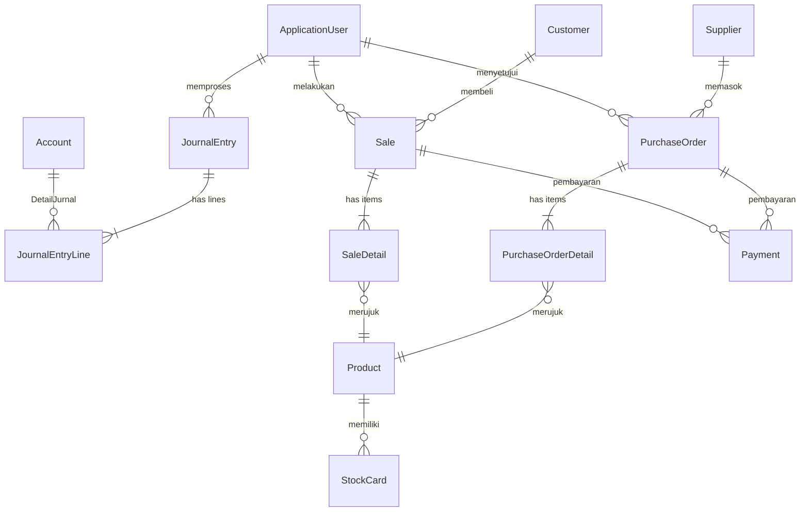

# Setup Repository & Struktur Solution .NET — SIA (Sistem Informasi Akuntansi)

Setup repository dan scaffolding seluruh solution structure untuk proyek capstone Sistem Informasi Akuntansi UMKM menggunakan Clean Architecture, Blazor Server (.NET 8), EF Core + MySQL, MudBlazor, dan ASP.NET Core Identity.

## Entity Mapping: ERD PRD ↔ C# Class

> [!IMPORTANT]
> Tabel ini menunjukkan pemetaan **1:1** antara setiap entitas di ERD PRD dengan class C# yang akan dibuat.
> **VarianProduk** bukan entity terpisah — Ukuran & Warna adalah atribut langsung di entity `Product`.

| # | Entitas ERD PRD | C# Entity Class | Atribut Utama |
|---|----------------|-----------------|---------------|
| 1 | **Pengguna** | `ApplicationUser` (extends IdentityUser) | Id, FullName, Email, Username, PasswordHash, Role, IsActive, CreatedAt |
| 2 | **Akun** | `Account` | Id, Code, Name, Category (enum), NormalBalance (enum), Balance |
| 3 | **JurnalUmum** | `JournalEntry` | Id, TransactionDate, Description, UserId (FK) |
| 4 | **JurnalDetail** | `JournalEntryLine` | Id, JournalEntryId (FK), AccountId (FK), Debit, Credit |
| 5 | **Produk** | `Product` | Id, Name, Description, Category, **Size, Color**, SellingPrice, PurchasePrice, Stock, ReorderPoint, SKU |
| 6 | **Pelanggan** | `Customer` | Id, Name, Phone, Address |
| 7 | **Pemasok** | `Supplier` | Id, Name, Phone, Address |
| 8 | **PenjualanHeader** | `Sale` | Id, SaleDate, CustomerId (FK), UserId (FK), TotalAmount, PaymentMethod (enum), PaymentStatus (enum), Notes |
| 9 | **PenjualanDetail** | `SaleDetail` | Id, SaleId (FK), **ProductId (FK)**, Quantity, UnitPrice, Subtotal |
| 10 | **PembelianHeader** | `PurchaseOrder` | Id, OrderDate, SupplierId (FK), UserId (FK), TotalAmount, Status (enum), ApprovedByUserId (FK), PaymentStatus (enum), Notes |
| 11 | **PembelianDetail** | `PurchaseOrderDetail` | Id, PurchaseOrderId (FK), **ProductId (FK)**, Quantity, UnitPrice, Subtotal |
| 12 | **Pembayaran** | `Payment` | Id, PaymentDate, PaymentType (enum), ReferenceId, ReferenceType (enum), Amount, Notes |
| 13 | **KartuStok** | `StockCard` | Id, **ProductId (FK)**, MovementDate, MovementType (enum), Quantity, StockBefore, StockAfter, Reference |

---

## Proposed Changes

### Solution & Project Structure

```
d:\Accounting Project\
├── src\
│   ├── SIA.Domain\             ← Class Library (.NET 8)
│   │   ├── Common\
│   │   │   └── BaseEntity.cs
│   │   ├── Entities\
│   │   │   ├── Accounting\     # Account, JournalEntry, JournalEntryLine
│   │   │   ├── Sales\          # Sale, SaleDetail, Customer
│   │   │   ├── Purchasing\     # PurchaseOrder, PurchaseOrderDetail, Supplier
│   │   │   ├── Inventory\      # Product, StockCard
│   │   │   └── Identity\       # ApplicationUser
│   │   └── Enums\              # AccountCategory, NormalBalance, PaymentMethod,
│   │                           # PaymentStatus, PurchaseOrderStatus,
│   │                           # StockMovementType, PaymentType
│   │
│   ├── SIA.Application\        ← Class Library (.NET 8)
│   │   ├── Common\
│   │   │   └── Interfaces\
│   │   │       ├── IRepository.cs
│   │   │       └── IUnitOfWork.cs
│   │   ├── Services\
│   │   │   ├── Accounting\     # IAccountService, IJournalService
│   │   │   ├── Sales\          # ISaleService, ICustomerService
│   │   │   ├── Purchasing\     # IPurchaseOrderService, ISupplierService
│   │   │   ├── Inventory\      # IProductService, IStockCardService
│   │   │   ├── Payments\       # IPaymentService
│   │   │   └── Reporting\      # IFinancialReportService
│   │   └── DTOs\               # Data Transfer Objects per module
│   │
│   ├── SIA.Infrastructure\     ← Class Library (.NET 8)
│   │   ├── Data\
│   │   │   ├── AppDbContext.cs
│   │   │   └── Configurations\ # EF Core Fluent API per entity
│   │   ├── Repositories\
│   │   │   └── Repository.cs
│   │   ├── Services\           # Concrete service implementations
│   │   └── DependencyInjection.cs
│   │
│   └── SIA.Web\                ← Blazor Web App (.NET 8, Server render mode)
│       ├── Components\
│       │   ├── Layout\         # MainLayout, NavMenu
│       │   └── Pages\
│       │       ├── Auth\       # Login, Logout
│       │       ├── Accounting\ # ChartOfAccounts, JournalEntries
│       │       ├── Sales\      # SalesList, SalesForm, CustomerList
│       │       ├── Purchasing\ # PurchaseOrderList, PurchaseOrderForm, SupplierList
│       │       ├── Inventory\  # ProductList, StockCard
│       │       └── Reporting\  # BalanceSheet, IncomeStatement, CashFlow
│       ├── wwwroot\
│       └── Program.cs
│
├── tests\
│   └── SIA.Tests\              ← xUnit Test Project (.NET 8)
│       ├── Domain\
│       ├── Application\
│       └── Infrastructure\
│
├── .github\
│   └── workflows\
│       └── ci.yml
│
├── SIA.sln
├── .gitignore
├── .editorconfig
└── README.md
```

---

### SIA.Domain — Entity & Enum Definitions

#### [NEW] `SIA.Domain.csproj`
Class library targeting `net8.0`. No external dependencies — pure C# domain model.

#### [NEW] `Common/BaseEntity.cs`
Abstract base class with `Id` (Guid), `CreatedAt` (DateTime), `UpdatedAt` (DateTime?) properties.

#### [NEW] `Entities/Identity/ApplicationUser.cs`
Extends `IdentityUser`. Maps to ERD **Pengguna**: `FullName`, `IsActive`, `CreatedAt`.

#### [NEW] `Entities/Accounting/Account.cs`
Maps to ERD **Akun**: `Code`, `Name`, `Category` (enum), `NormalBalance` (enum), `Balance`, `Description`, `IsActive`.

#### [NEW] `Entities/Accounting/JournalEntry.cs`
Maps to ERD **JurnalUmum**: `TransactionDate`, `Description`, `UserId` (FK). Contains `List<JournalEntryLine>`.

#### [NEW] `Entities/Accounting/JournalEntryLine.cs`
Maps to ERD **JurnalDetail**: `JournalEntryId` (FK), `AccountId` (FK), `Debit`, `Credit`.

#### [NEW] `Entities/Sales/Customer.cs`
Maps to ERD **Pelanggan**: `Name`, `Phone`, `Address`.

#### [NEW] `Entities/Sales/Sale.cs`
Maps to ERD **PenjualanHeader**: `SaleDate`, `CustomerId` (FK), `UserId` (FK), `TotalAmount`, `PaymentMethod` (enum), `PaymentStatus` (enum), `Notes`. Contains `List<SaleDetail>`.

#### [NEW] `Entities/Sales/SaleDetail.cs`
Maps to ERD **PenjualanDetail**: `SaleId` (FK), `ProductId` (FK), `Quantity`, `UnitPrice`, `Subtotal`.

#### [NEW] `Entities/Purchasing/Supplier.cs`
Maps to ERD **Pemasok**: `Name`, `Phone`, `Address`.

#### [NEW] `Entities/Purchasing/PurchaseOrder.cs`
Maps to ERD **PembelianHeader**: `OrderDate`, `SupplierId` (FK), `UserId` (FK), `TotalAmount`, `Status` (enum), `ApprovedByUserId` (FK), `PaymentStatus` (enum), `Notes`. Contains `List<PurchaseOrderDetail>`.

#### [NEW] `Entities/Purchasing/PurchaseOrderDetail.cs`
Maps to ERD **PembelianDetail**: `PurchaseOrderId` (FK), `ProductId` (FK), `Quantity`, `UnitPrice`, `Subtotal`.

#### [NEW] `Entities/Inventory/Product.cs`
Maps to ERD **Produk** (termasuk varian): `Name`, `Description`, `Category`, **`Size`**, **`Color`**, `SellingPrice`, `PurchasePrice`, `Stock`, `ReorderPoint`, `SKU`. Variant attributes (Size, Color) adalah property langsung, bukan entity terpisah.

#### [NEW] `Entities/Inventory/StockCard.cs`
Maps to ERD **KartuStok**: `ProductId` (FK), `MovementDate`, `MovementType` (enum), `Quantity`, `StockBefore`, `StockAfter`, `Reference`.

#### [NEW] `Entities/Payments/Payment.cs`
Maps to ERD **Pembayaran**: `PaymentDate`, `PaymentType` (enum), `ReferenceId`, `ReferenceType` (enum: Sale/Purchase), `Amount`, `Notes`.

#### [NEW] `Enums/*.cs`
- `AccountCategory` — AsetLancar, AsetTetap, LiabilitasJangkaPendek, Ekuitas, Pendapatan, BebanPokokPenjualan, BebanOperasional
- `NormalBalance` — Debit, Credit
- `PaymentMethod` — Cash, Transfer
- `PaymentStatus` — Paid, Unpaid
- `PurchaseOrderStatus` — Draft, Approved, Received, Cancelled
- `StockMovementType` — In, Out
- `PaymentType` — Cash, Transfer

---

### SIA.Application — Interfaces, Services & DTOs

#### [NEW] `SIA.Application.csproj`
References `SIA.Domain`. No infrastructure dependencies.

#### [NEW] `Common/Interfaces/IRepository.cs`
Generic repository: `GetByIdAsync`, `GetAllAsync`, `AddAsync`, `Update`, `Delete`, `FindAsync(predicate)`.

#### [NEW] `Common/Interfaces/IUnitOfWork.cs`
`SaveChangesAsync()` + exposes typed repositories.

#### [NEW] Service interfaces per modul
- `IAccountService` — CRUD akun (Chart of Accounts)
- `IJournalService` — posting double-entry, validasi debit = kredit
- `ISaleService` — buat transaksi penjualan, otomatis posting jurnal + kurangi stok
- `ICustomerService` — CRUD pelanggan
- `IPurchaseOrderService` — buat PO, approval, terima barang
- `ISupplierService` — CRUD pemasok
- `IProductService` — CRUD produk (termasuk varian size/color)
- `IStockCardService` — kartu stok, reorder alert
- `IPaymentService` — pencatatan pembayaran piutang/utang
- `IFinancialReportService` — generate neraca, laba rugi, arus kas

---

### SIA.Infrastructure — EF Core, Repositories, Concrete Services

#### [NEW] `SIA.Infrastructure.csproj`
References `SIA.Application` & `SIA.Domain`. NuGet packages:
- `Pomelo.EntityFrameworkCore.MySql`
- `Microsoft.AspNetCore.Identity.EntityFrameworkCore`
- `Microsoft.EntityFrameworkCore.Design`

#### [NEW] `Data/AppDbContext.cs`
Inherits `IdentityDbContext<ApplicationUser>`. All 13 entities registered as `DbSet<>`.

#### [NEW] `Data/Configurations/*.cs`
`IEntityTypeConfiguration<T>` per entity.

#### [NEW] `Repositories/Repository.cs`
Generic `Repository<T> : IRepository<T>` implementation.

#### [NEW] `DependencyInjection.cs`
Extension method `AddInfrastructure(this IServiceCollection, IConfiguration)`.

---

### SIA.Web — Blazor Server Frontend

#### [NEW] `SIA.Web.csproj`
Blazor Web App. References `SIA.Application` & `SIA.Infrastructure`. NuGet: `MudBlazor`.

#### [NEW] `Program.cs`
Complete startup: DI, Identity config, MudBlazor, auth middleware, HTTPS.

#### [NEW] `Components/Layout/MainLayout.razor` & `NavMenu.razor`
MudBlazor layout + navigation sesuai modul PRD.

#### [NEW] Placeholder pages per modul

---

### SIA.Tests — xUnit Test Project

#### [NEW] `SIA.Tests.csproj`
xUnit + Moq. References Domain, Application, Infrastructure.

---

### Repository Files

#### [NEW] `.gitignore` — .NET/Visual Studio template
#### [NEW] `.editorconfig` — C# coding conventions
#### [NEW] `README.md` — Deskripsi proyek (Bahasa Indonesia)
#### [NEW] `.github/workflows/ci.yml` — Build & test on push/PR

---

## Relasi antar Entity (sesuai ERD)



---

## Verification Plan

### Automated Verification
```powershell
# 1. Build seluruh solution
dotnet build SIA.sln

# 2. Jalankan tests
dotnet test SIA.sln

# 3. Run aplikasi
dotnet run --project src/SIA.Web
```

### Manual Verification
- Verifikasi 13 entity class sesuai mapping table di atas
- Verifikasi project references benar
- Verifikasi .gitignore berfungsi
